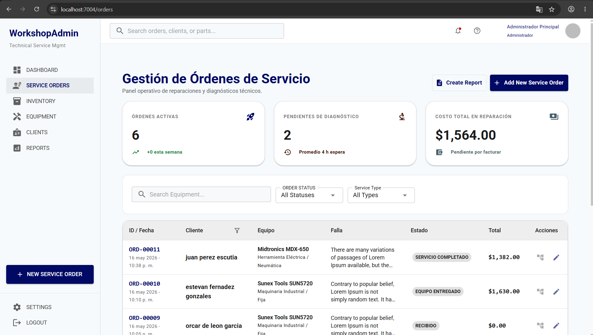
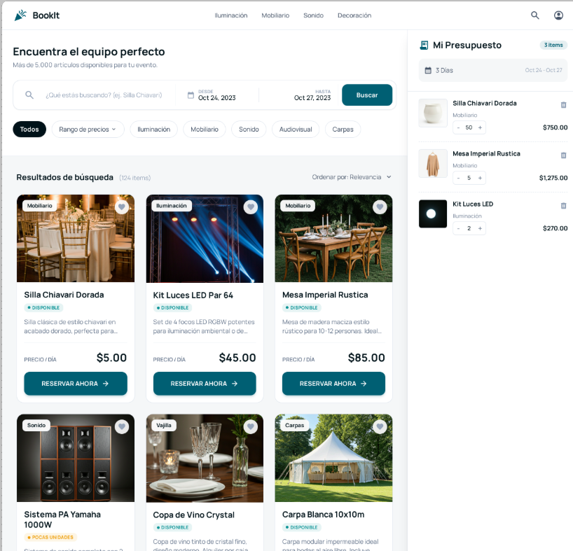

  

## About me
- Ingeniero Mecatrónico con experiencia en desarrollo de software, especializado en tecnologías .NET y JavaScript. He participado en diversos proyectos empresariales, desarrollando soluciones escalables y eficientes. Me considero una persona autodidacta, responsable y comprometida con la calidad del código y la optimización de procesos.

## Main Projects

| Proyecto: **WorkshopAdmin** | Sistema de Gestión de Taller y Servicios |
|----------------------|-------------|
||**Esta aplicación permite a los usuarios reservar mobiliario, equipo de iluminación y otros recursos necesarios para realizar toda clase de eventos de forma rápida y eficiente, optimizando la gestión de disponibilidad para los administradores. Está dirigida a clientes que necesiten un proveedor integral para sus eventos y permite a los organizadores optimizar recursos y mejorar la experiencia del cliente final. Desarrollada con React, .NET y PostgreSQL, con autenticación JWT y despliegue en Railway. Mi aporte incluye el diseño de la base de datos, la API REST, la lógica de reservas y el frontend responsivo. Proyecto funcional con versión de prueba disponible.**    [🚀 Ver Demo](#)  [📄 Ver Documentación](https://github.com/jose-angell/WorkshopAdmin)           |

| Proyecto: **Book It** | App de Reservas Online |
|----------------------|-------------|
||Esta aplicación permite a los usuarios reservar mobiliario, equipo de iluminación y otros recursos necesarios para realizar toda clase de eventos de forma rápida y eficiente, optimizando la gestión de disponibilidad para los administradores. Está dirigida a clientes que necesiten un proveedor integral para sus eventos y permite a los organizadores optimizar recursos y mejorar la experiencia del cliente final. Desarrollada con React, .NET y PostgreSQL, con autenticación JWT y despliegue en Railway. Mi aporte incluye el diseño de la base de datos, la API REST, la lógica de reservas y el frontend responsivo. Proyecto funcional con versión de prueba disponible.    [🚀 Ver Demo](#)  [📄 Ver Documentación](https://jose-angell.github.io/EventResourceReservationAppDocs/)           |

  
## Technologies
<kbd>
<kbd>Programming Languages</kbd>
 
 &nbsp;
 &nbsp;
 &nbsp;
 &nbsp;
 
 &nbsp;
  &nbsp;
 &nbsp;
 &nbsp;
</kbd>&nbsp;&nbsp;
<kbd>
<kbd>Frameworks</kbd>
 
 &nbsp;
 &nbsp;
&nbsp;
  
 &nbsp;
&nbsp;
 &nbsp;
</kbd>&nbsp;&nbsp;
<kbd>
<kbd>Libraries</kbd>
 
 &nbsp;
 &nbsp;
</kbd>&nbsp;&nbsp;
<kbd>
<kbd>Database</kbd>
 
 &nbsp;
 &nbsp;
 &nbsp;
 &nbsp;
</kbd>&nbsp;&nbsp;
<kbd>
<kbd>Tools</kbd>
 
  &nbsp;
 &nbsp;
 &nbsp;
 &nbsp;
  
 &nbsp;
 &nbsp;
&nbsp;
 &nbsp;
</kbd>

  
<picture>   </picture> Github Stats
<table align="center" width="100%">
<tr>
<td width="100%" align="center">
 
&nbsp;&nbsp;

    

 
</td>
</tr>
</table>
